# PCBuilderShop

## 👥 Miembros del Equipo
| Nombre y Apellidos | Correo URJC | Usuario GitHub |
|:--- |:--- |:--- |
| David Díaz Gómez-Escalonilla | d.diaz.2021@alumnos.urjc.es | daviddge |
| Jonay Sebastián Ortiz Armas| js.ortiz.2023@alumnos.urjc.es | kuuharuh |
| Ramiro Daniel Flores Aquino | rd.flores.2025@alumnos.urjc.es | danilo-uni |
| Joel Domené Álvaro | j.domene.2022@alumnos.urjc.es |  joel-domene |

---

## 🎭 **Preparación: Definición del Proyecto**

### **Descripción del Tema**
Aplicación web dedicada exclusivamente a la venta de componentes de PC, orientada al sector de la informática y el hardware. La plataforma ofrece un catálogo especializado (CPU, GPU, RAM, placas base, SSDs y otros componentes) pensado para usuarios que desean montar, actualizar o personalizar su propio ordenador. Se busca aportar al usuario un entorno centrado únicamente en componentes, facilitando la comparación, selección y compra de piezas compatibles.

### **Entidades**

1. **Usuario**
2. **Producto**
3. **Pedido**
4. **Reseña**

**Relaciones entre entidades:**
- Usuario - Pedido: Cada usuario registrado puede generar uno o varios pedidos (1:N).
- Pedido - Producto: Un pedido está compuesto por distintos productos, y un mismo producto puede aparecer en varios pedidos (N:M).
- Usuario - Reseña : Un usuario puede escribir multiples reseñas sobre productos adquiridos (1:N).
- Producto - Reseña: Un producto puede tener distintas reseñas publicadas por los usuarios (1:N).

### **Permisos de los Usuarios**

**Usuario Anónimo**: 
  - Permisos: Explorar catálogo, buscar productos, registrarse/iniciar sesion.
  - No es dueño de ninguna entidad.

**Usuario Registrado**: 
  - Permisos: Gestionar su perfil, escribir reseñas y gestionar pedido.
  - Es dueño de sus propios pedidos, de su usuario y sus reseñas.

**Administrador**: 
  - Permisos: Gestión completa de productos (CRUD), visualizar estadísticas, administrar reseñas, gestionar promociones, supervisar usuarios y pedidos.
  - Tiene acceso y control sobre todas las entidades del sistema (Pedidos, Usuarios, Productos y Reseñas).

### **Imágenes**

- Usuario - Se podrá subir una imagen de perfil.
- Producto - Dispondrá de una galería de imágenes para mostrar distintos ángulos o detalles.
- Reseña - Permite añadir imagenes opcionales subidas por el usuario.

### **Gráficos**

- Evolución de ventas mensuales - Gráfico de lineas
- Stock de productos - Gráfico circular
- Distribución de pedidos por categoría - Gráfico de barras
- Valoración media de los productos - Sistemas de estrellas o barras

### **Tecnología Complementaria**

- Envío automático correos electrónicos mediante JavaMailSender.
- Generación de facturas en formato PDF usando iText o similar.

### **Algoritmo o Consulta Avanzada**

- **Algoritmo/Consulta**: Sistema de recomendaciones de distintos productos basado en el historial de compras del usuario.
- **Descripción**: Se analizarán los productos adquiridos anteriormente con el objetivo de sugerir otros productos similares o complementarios a través de técnicas de filtrado colaborativo.
- **Alternativa**: Consulta avanzada que agrupe ventas por categoría, mes y región, identificando patrones o tendencias.

---

## 🛠 **Práctica 1: Maquetación de páginas web con HTML y CSS**

### **Diagrama de Navegación**
Diagrama que muestra cómo se navega entre las diferentes páginas de la aplicación:

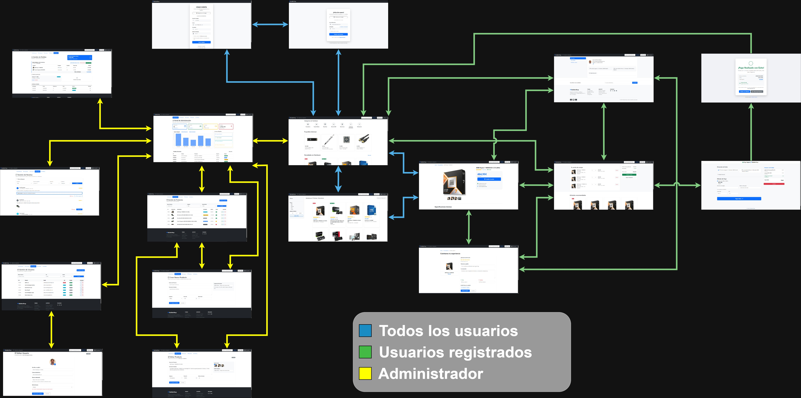


Todos los usuarios parte desde la página principal, y hay acceso sin restricciones a las páginas de busqueda, página del producto y las pantallas de inicio de sesión y registro. Sin embargo, las páginas correspondientes al perfil, el carrito de compra, proceso de pago y crear reseñas requieren que el usuario haya iniciado su sesión. El administrador tiene acceso a todas las pantallas anteriores, además del admin-dashboard, que es el panel de control del admin donde puede administrar cada entidad de la página.

### **Capturas de Pantalla y Descripción de Páginas**

#### **1. Página Principal / Home**

Esta es la pagina principal de la pagina en la que tenemos una serie de productos recomendados, además de distintas novedades en hardware. En el header se incluye la barra de navegación, el acceso a la cesta para usuarios registrados, y boton dropdown que permite acceder al perfil o cerrar sesión. En el caso de no estar logueado, se muestra un botón "Entrar" para iniciar sesión o registrarse.


-  La pagina de incio tambien te muestra las categorias de hardware disponibles, las cuales también se pueden visualizar desde el menu desplegable del header dandole a "categorias"


#### **RESTO DE PÁGINAS**

#### **TODOS LOS USUARIOS**

#### **2. Pagina de busqueda:**
Muestra una lista de  productos en una cuadrícula con sus datos principales. También tiene implementada una barra lateral con filtros por marca y rango de precio, además de un selector para ordenar los resultados según lo que busque el usuario.


#### **3. Pagina de Producto:**
Maquetación detallada del componente con un carrusel de imágenes y la zona de compra. Contiene una tabla para las especificaciones técnicas y una sección de reseñas donde los usuarios pueden ver las valoraciones y opiniones de otros compradores.
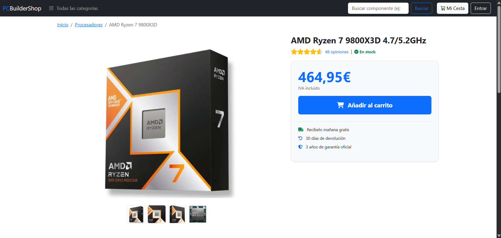

#### **4. Pagina de Login:**
En esta pantalla nos muestra como una persona que ya tiene cuenta de la pagina puede inciar sesion añadiendo su correo y contraseña o tambien te da la opcion de iniciar sesion con tu cuenta de google.

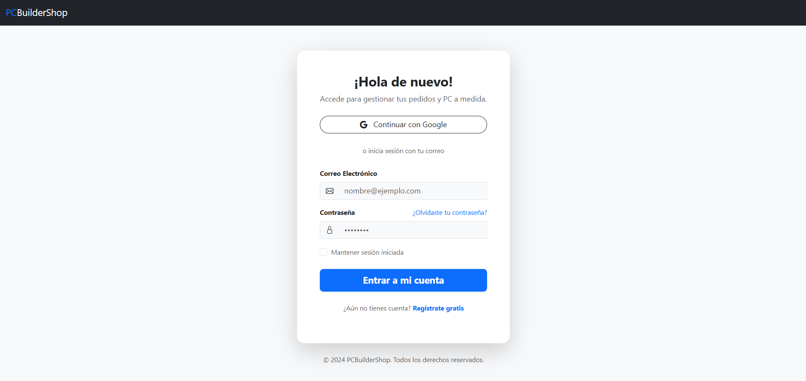

#### **5. Pagina de Registro:**
Esta pantalla es para que las personas que no tienen cuenta creada, la puedan tener añadiendo sus datos como correo, nombre, contraseña(repetir contraseña) y aceptar por obligacion las politicas de privacidad. Aqui tambien te da la opcion como el login en la que puedes resgistrarte con google.


#### **USUARIOS REGISTRADOS**

#### **6. Pagina de Perfil:**
Muestra el perfil del usuario. Incluye 3 pestañas:
- Perfil: muestra la página de perfil pública, mostrando el nombre, la foto de perfil y las reseñas.
- Pedidos: muestra los pedidos en curso del usuario.
- Modificar cuenta: permite modificar la información de la cuenta (nombre, teléfono, email, direcciones) o borrar la cuenta.

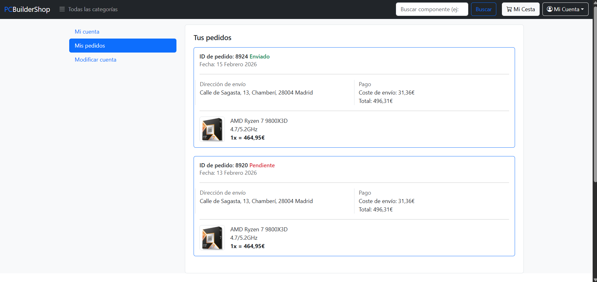


#### **7. Pagina de Carrito:**
Muestra el carrito de compra del usuario, incluyendo el precio y la cantidad de cada artículo, y permitiendo quitar artículos o finalizar la compra. También aparecen artículos recomendados en la parte inferior.
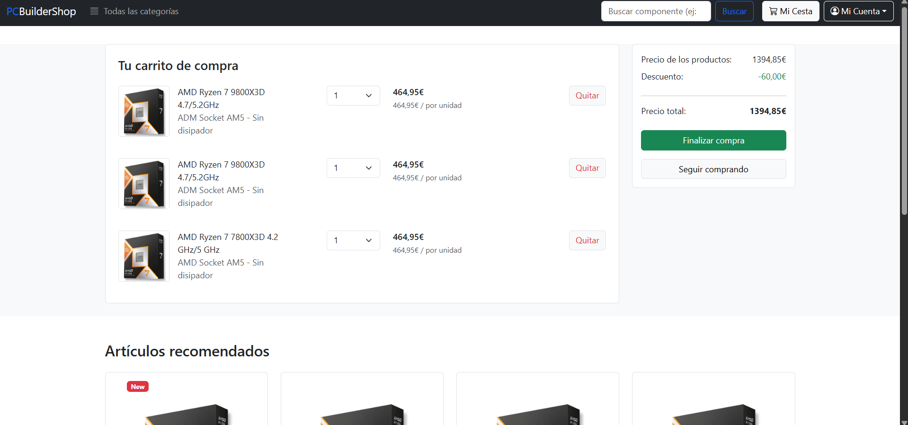

#### **8. Pagina de Pago:**
En esta pantalla podemos ver como hemos implentado la forma de pago en lo que podemos seleccionar(solo una) y añadir la direccion del envio , tambien nos permite el tipo de pago (Tarjeta o PayPal) y el relleno de los datos de la tajeta. Y para hacer un seguimiento de la compra ,en el lado derecho de la pantalla se ve el resumen de la compra con el precio total y listo el boton para comprar y para salir si se arrepiente.

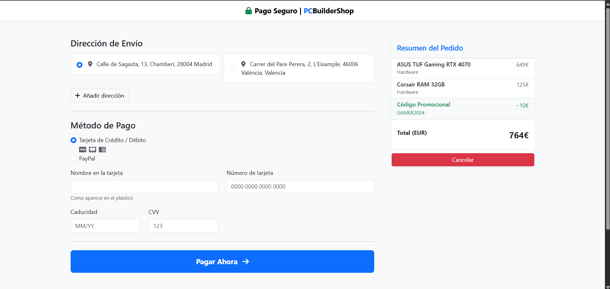

En esta pantalla basicamente nos muestra el resultado de la compra al saber que el pago a sido recibido correctamente y además nos sale la opcion de descargar el pdf para ver la factura de la compra, al lado suyo tambien con el boton de volver a la tienda para seguir comprando o viendo mas componentes.


#### **9. Pagina de Crear Review:**
Formulario para que los usuarios valoren los productos comprados. Incluye un sistema de puntuación por estrellas, campos de texto para el título y el comentario, y secciones específicas para listar pros y contras, además de permitir la subida de imágenes reales del componente.


#### **ADMINISTRADOR**

#### **10. Pagina de Admin-Dashboard:**

Página principal del panel de administración de la tienda, donde se muestra un resumen general del sistema con diferentes estadísticas como número de productos, usuarios, pedidos e ingresos. Incluye gráficas de ventas e inventario, accesos rápidos a funciones administrativas y una tabla con los pedidos recientes.
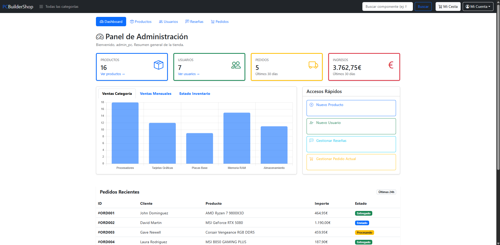

#### **11. Pagina de Lista Producto:**

Página de gestión de productos del panel de administración que muestra el catálogo en formato tabular con información de cada artículo (imagen, categoría, precio y stock). Permite buscar y filtrar productos, así como realizar acciones de administración como crear, editar o eliminar.
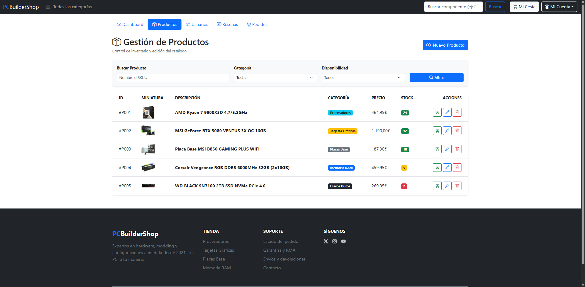

#### **12. Pagina de Crear Producto:**

Página que permite al administrador crear un nuevo producto para el catálogo de la tienda mediante un formulario con campos como nombre, descripción, categoría, precio y stock. Incluye la opción de subir múltiples imágenes (con previsualización de estas) antes de publicar el producto.


#### **13. Pagina de Editar Producto:**

Página que permite al administrador editar la información de un producto existente del catálogo. El formulario muestra los datos previamente rellenados (nombre, descripción, categoría, precio y stock) y permite modificarlos antes de guardar los cambios.
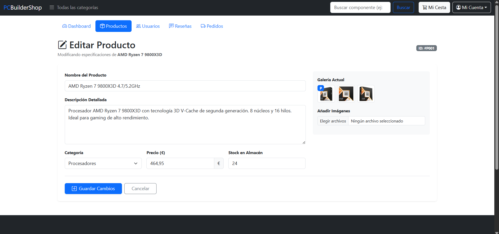

#### **14. Pagina de Lista Usuarios:**

Página de administración que muestra el listado de usuarios registrados en la plataforma junto con información como nombre, correo electrónico, rol y estado de conexión. Permite buscar y filtrar usuarios, así como realizar acciones de gestión como ver, editar, crear o eliminar cuentas.
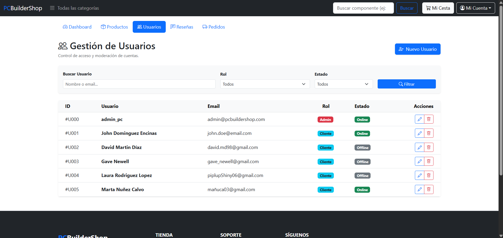

#### **15. Pagina de Editar Usuarios:**

Página que permite al administrador editar la información de un usuario existente, incluyendo nombre, correo electrónico, contraseña y rol dentro del sistema. También muestra y permite actualizar la imagen de perfil del usuario antes de guardar los cambios.


#### **16. Pagina de Lista Reseñas:**

Página del panel de administración dedicada a la gestión de reseñas de los clientes sobre los productos de la tienda. Permite filtrar opiniones, responder o editar respuestas oficiales del administrador y eliminar reseñas inapropiadas.
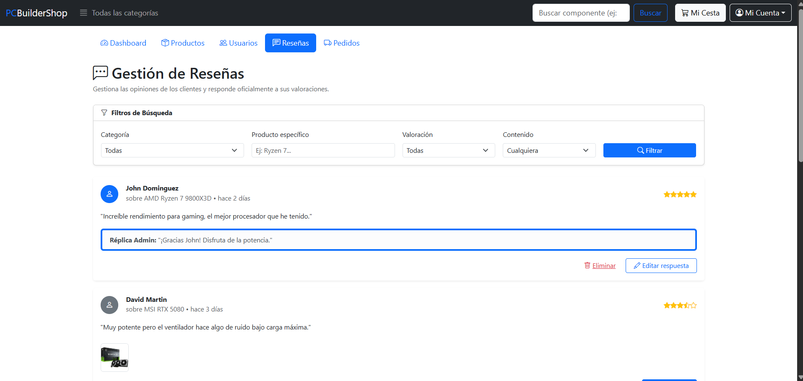

#### **17. Pagina de Lista Pedidos:**

Página del panel de administración para la gestión de pedidos de clientes. Muestra métricas generales, herramientas de control de inventario, filtros de búsqueda y una tabla con los pedidos donde el administrador puede consultar, editar o cancelar cada pedido.
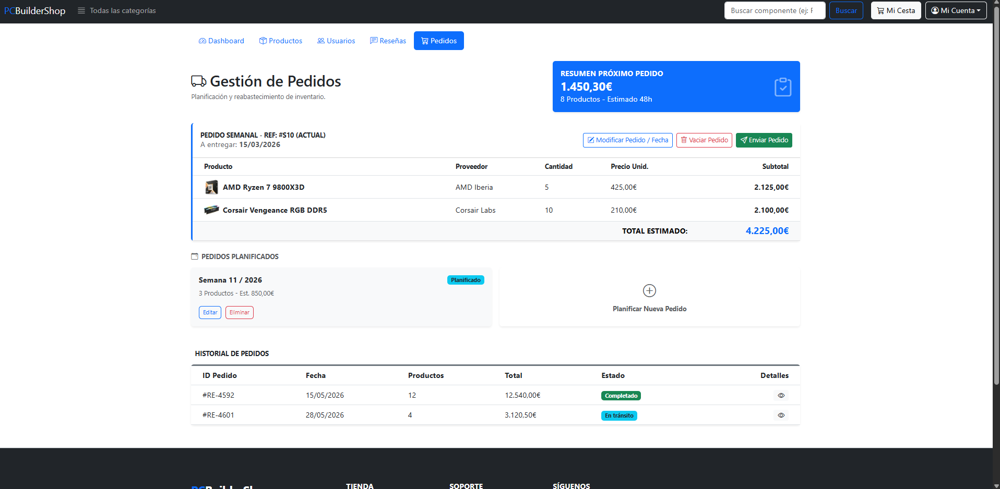

### **18. Pagina de Editar Pedidos:**

Página del panel de administración que muestra el detalle de un pedido individual de un cliente. Permite consultar la información del cliente, los productos comprados y el resumen económico, así como actualizar el estado del pedido, añadir notas internas y notificar al cliente por correo.
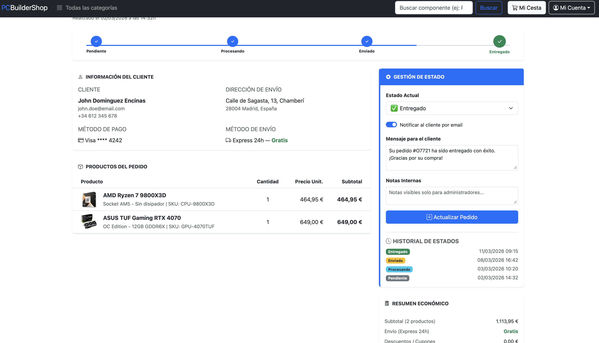

### **19. Pagina de Pedidos Reabastecimiento:**

Página del panel de administración destinada a la gestión del reabastecimiento de inventario. Permite visualizar el pedido semanal actual, planificar nuevos pedidos para semanas futuras y consultar el historial de pedidos realizados a proveedores. También ofrece herramientas para modificar cantidades, fechas o añadir productos a los pedidos.
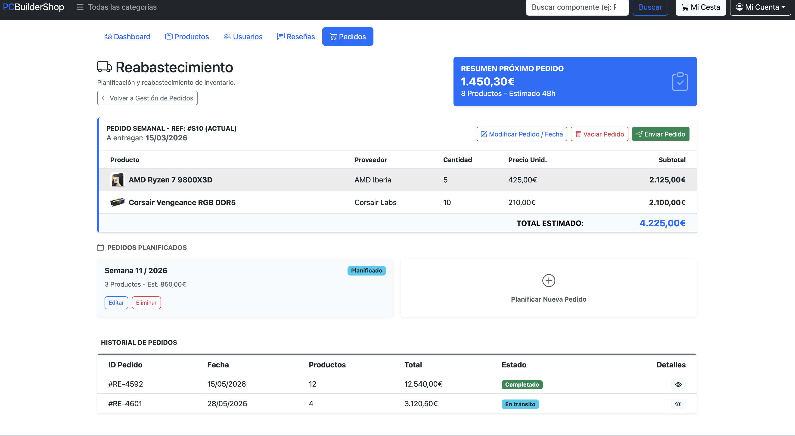

### **Participación de Miembros en la Práctica 1**

#### **Alumno 1 - Ramiro Daniel Flores Aquino**

Mi participación fue el encargado de la implementacion y edición de las paginas del menú principal(index.html), implementé las paginas de login(login.html) y registro(user_registration.html) y también las paginas de pago(payment.html) y la pantalla de pago correcto(payment_correct.html).

| Nº    | Commits      | Files      |
|:------------: |:------------:| :------------:|
|1| [Estrucutura base y navegación del menu principal ](https://github.com/CodeURJC-SSDD-2025-26/practica-ssdd-2025-26-grupo-4/commit/68e97783e08ce6d9a00c434f09738d519f64456f)  | [index.html](https://github.com/CodeURJC-SSDD-2025-26/practica-ssdd-2025-26-grupo-4/blob/main/index.html)   |
|2| [Implementación de formulario de login y validación básica ,pudiendo el usuario tener mas privilegios](https://github.com/CodeURJC-SSDD-2025-26/practica-ssdd-2025-26-grupo-4/commit/0fef36f48eb0db1b5feb60c2c901625b43f277dc)  | [login.html](https://github.com/CodeURJC-SSDD-2025-26/practica-ssdd-2025-26-grupo-4/blob/main/pages/login.html)   |
|3| [Creación de pagina de registro de usuarios, permitiendo crear la cuenta del usuario con datos personales](https://github.com/CodeURJC-SSDD-2025-26/practica-ssdd-2025-26-grupo-4/commit/ebcfcdc8e9ab164e8b244fc76657fcf496a8a7be)  | [user_registration.html](URL_archivo_3https://github.com/CodeURJC-SSDD-2025-26/practica-ssdd-2025-26-grupo-4/blob/main/pages/user_registration.html)   |
|4| [Integración de pasarela de pago y campos de tarjeta para que el usuario pueda tener mas libertad de elección](https://github.com/CodeURJC-SSDD-2025-26/practica-ssdd-2025-26-grupo-4/commit/a5b9f8911bf89ee3177a08034087619ae023b767)  | [payment.html](URL_archttps://github.com/CodeURJC-SSDD-2025-26/practica-ssdd-2025-26-grupo-4/blob/main/pages/payment.htmlhivo_4)   |
|5| [Diseño de pantalla de confirmación de pago con exito](URL_commihttps://github.com/CodeURJC-SSDD-2025-26/practica-ssdd-2025-26-grupo-4/commit/f8c43e8576d007e2877ec18462194b2d3da58fedt_5)  | [payment_correct.html](https://github.com/CodeURJC-SSDD-2025-26/practica-ssdd-2025-26-grupo-4/blob/main/pages/payment_correct.html)   |

---

#### **Alumno 2 - David Díaz Gómez-Escalonilla**

Principal responsable de las páginas de search-result, item-detail, create-review y los headers. También he ayudado con la estructura del index.html para que fuera similar a la de search-result, además de crear la implementacion inicial de las paginas user-list, user-edit, order-list, order-edit, las cuales han sido mejoradas posteriormente por otros compañeros. Creación y diseño del diagrama de navegación de README

| Nº    | Commits      | Files      |
|:------------: |:------------:| :------------:|
|1| [Construccion de estructura básica de search-result html, incluyendo estilos css, cabecera, pie de pagina, filtros y los primeros ejemplos de productos](https://github.com/CodeURJC-SSDD-2025-26/practica-ssdd-2025-26-grupo-4/commit/492fb1a6cb0778e6813eb550ac9eca71604968f7)  | [search-result.html](https://github.com/CodeURJC-SSDD-2025-26/practica-ssdd-2025-26-grupo-4/blob/492fb1a6cb0778e6813eb550ac9eca71604968f7/pages/search-result.html)   |
|2| [Implementacion de la pagina del producto, añadiendo también la tabla de especificaciones y la seccion de comentarios y reseñas](https://github.com/CodeURJC-SSDD-2025-26/practica-ssdd-2025-26-grupo-4/commit/bafb9f9ef63e13400de7bd6b56348491aaad526d)  | [item-detail](https://github.com/CodeURJC-SSDD-2025-26/practica-ssdd-2025-26-grupo-4/blob/bafb9f9ef63e13400de7bd6b56348491aaad526d/pages/item-detail.html)   |
|3| [Implementacion de la pagina de creaciond e reseñas, permitiendo crear una reseña con una descripcion y destacar pros y contras del producto](https://github.com/CodeURJC-SSDD-2025-26/practica-ssdd-2025-26-grupo-4/commit/07b45dbbc1914c7f83cfd0d22323ff531d967da7)  | [create-review](https://github.com/CodeURJC-SSDD-2025-26/practica-ssdd-2025-26-grupo-4/blob/07b45dbbc1914c7f83cfd0d22323ff531d967da7/pages/create-review.html)   |
|4| [Creacion, optimizacion y modularizacion de headers independientes para usuarios logueados y no logueados con el objetivo de evitar codigo duplicado](https://github.com/CodeURJC-SSDD-2025-26/practica-ssdd-2025-26-grupo-4/commit/a6e834f70750229803f921ac1b096a6e083267ba)  | [loged_header.html](https://github.com/CodeURJC-SSDD-2025-26/practica-ssdd-2025-26-grupo-4/blob/a6e834f70750229803f921ac1b096a6e083267ba/pages/headers/loged_header.html)   | [unloged_header.html](https://github.com/CodeURJC-SSDD-2025-26/practica-ssdd-2025-26-grupo-4/blob/a6e834f70750229803f921ac1b096a6e083267ba/pages/headers/unloged_header.html)
|5| [Creacion y modularizacion de footer](https://github.com/CodeURJC-SSDD-2025-26/practica-ssdd-2025-26-grupo-4/commit/d953c975fd888a16b8a9fc3214d2ce4db1270252)  | [ArchivoX](URL_archivo_5)   |
|6| [Creacion de estructura inicial basica de paginas de admin e implementacion de user-list, permitiendo visualizar todos los perfiles y su info correspondiente en una tabla](https://github.com/CodeURJC-SSDD-2025-26/practica-ssdd-2025-26-grupo-4/commit/0b310a7a427ae7dc01e95dc00e41efc0883fc885)  | [user-list.html](https://github.com/CodeURJC-SSDD-2025-26/practica-ssdd-2025-26-grupo-4/blob/0b310a7a427ae7dc01e95dc00e41efc0883fc885/pages/admin/user-list.html)   |
|7| [Implementacion de pantallas de lista de productos y edicion de productos, pudiendo visualizar informacion relevante sobre cada pedido en una tabla y esditar su estado respectivamente](https://github.com/CodeURJC-SSDD-2025-26/practica-ssdd-2025-26-grupo-4/commit/2f55ddab736a82327ef2cccd7a5c143c610ee390)  | [order-list.html](https://github.com/CodeURJC-SSDD-2025-26/practica-ssdd-2025-26-grupo-4/blob/2f55ddab736a82327ef2cccd7a5c143c610ee390/pages/admin/order-list.html)   | [order-edit.html](https://github.com/CodeURJC-SSDD-2025-26/practica-ssdd-2025-26-grupo-4/blob/2f55ddab736a82327ef2cccd7a5c143c610ee390/pages/admin/order-edit.html)  


---

#### **Alumno 3 - Jonay Sebastián Ortiz Armas**

Principal responsable de las páginas de perfil y carrito de compra, además de algunos cambios en el header y la página de pago. También hice el logo de la página.

| Nº    | Commits      | Files      |
|:------------: |:------------:| :------------:|
|1| [Añadir página de perfil de usuario](https://github.com/CodeURJC-SSDD-2025-26/ssdd-2025-26-project-base/commit/0a580df10a0e133a60755ceea097ec4c25b4ce75)  | [profile.html](https://github.com/CodeURJC-SSDD-2025-26/practica-ssdd-2025-26-grupo-4/blob/main/pages/profile.html)   |
|2| [Modificar barra lateral de la página de perfil](https://github.com/CodeURJC-SSDD-2025-26/ssdd-2025-26-project-base/commit/51eee89e8c182d4ad7268c30c9fa9bd8d157378e)  | [profile.html](https://github.com/CodeURJC-SSDD-2025-26/practica-ssdd-2025-26-grupo-4/blob/main/pages/profile.html)   |
|3| [Enlazar botones de compra en la página de carrito](https://github.com/CodeURJC-SSDD-2025-26/ssdd-2025-26-project-base/commit/ab334d8ac5258d692de3a15f06fd1f83374687e5)  | [shopping-cart.html](https://github.com/CodeURJC-SSDD-2025-26/practica-ssdd-2025-26-grupo-4/blob/main/pages/shopping-cart.html)   |
|4| [Arreglar botón de buscar en el loged_header](https://github.com/CodeURJC-SSDD-2025-26/ssdd-2025-26-project-base/commit/4d904aa1d8b2a732518f65579b8af51760da27f7)  | [loged_header.html](https://github.com/CodeURJC-SSDD-2025-26/practica-ssdd-2025-26-grupo-4/blob/main/pages/headers/loged_header.html)   |
|5| [Añadir a la página de pago la función de usar una dirección guardada en el perfil](https://github.com/CodeURJC-SSDD-2025-26/ssdd-2025-26-project-base/commit/a6d1c3125ca831d9c63b8d6eee45fee370f235bb)  | [payment.html](https://github.com/CodeURJC-SSDD-2025-26/practica-ssdd-2025-26-grupo-4/blob/main/pages/payment.html)   |
|6| [Añadir favicon e incluirlo en páginas de perfil y carrito](https://github.com/CodeURJC-SSDD-2025-26/ssdd-2025-26-project-base/commit/09479074f8c2a0ec56a74a3dde5ef9fd143f820a)  | [logo.png](https://github.com/CodeURJC-SSDD-2025-26/practica-ssdd-2025-26-grupo-4/blob/main/assets/icons/logo.png)   |
|7| [AÑadir botón de admin en páginas de perfil y carrito](https://github.com/CodeURJC-SSDD-2025-26/ssdd-2025-26-project-base/commit/2284a36e0debfd42c837ef0cf9801a6335478c9f)  | [profile.html](https://github.com/CodeURJC-SSDD-2025-26/practica-ssdd-2025-26-grupo-4/blob/main/pages/profile.html)   |
|8| [Arreglar botón de buscar en el unloged_header](https://github.com/CodeURJC-SSDD-2025-26/ssdd-2025-26-project-base/commit/4d904aa1d8b2a732518f65579b8af51760da27f7)  | [unloged_header.html](https://github.com/CodeURJC-SSDD-2025-26/practica-ssdd-2025-26-grupo-4/blob/main/pages/headers/unloged_header.html)   |

---

#### **Alumno 4 - Joel Domené Álvaro**

[Descripción de las tareas y responsabilidades principales del alumno en el proyecto]

| Nº    | Commits      | Files      |
|:------------: |:------------:| :------------:|
|1| [Panel de administración, gestión de productos, usuarios y reseñas](https://github.com/CodeURJC-SSDD-2025-26/ssdd-2025-26-project-base/commit/22b0c83ef82111b8a5f8d482512c4f6189fe3990)  |  [admin-dashboaard]([pages/admin/admin-dashboard.html](https://github.com/CodeURJC-SSDD-2025-26/practica-ssdd-2025-26-grupo-4/blob/main/pages/admin/admin-dashboard.html)) 
|1| Algunas páginas: |  [item-list.html]([pages/admin/item-list.html](https://github.com/CodeURJC-SSDD-2025-26/practica-ssdd-2025-26-grupo-4/blob/main/pages/admin/item-list.html))
|1|  |  [user-list.html]([pages/admin/user-list.html](https://github.com/CodeURJC-SSDD-2025-26/practica-ssdd-2025-26-grupo-4/blob/main/pages/admin/user-list.html))
|1|  |  [review-list]([pages/admin/review-list.html](https://github.com/CodeURJC-SSDD-2025-26/practica-ssdd-2025-26-grupo-4/blob/main/pages/admin/review-list.html))
|2| [Gestión de Pedidos, de usuarios y reabastecimiento](https://github.com/CodeURJC-SSDD-2025-26/practica-ssdd-2025-26-grupo-4/commit/89d7e8b39d4967bb644eaa116d14a87df00ecbfa)  |  [order-list.html](https://github.com/CodeURJC-SSDD-2025-26/practica-ssdd-2025-26-grupo-4/blob/main/pages/admin/order-list.html)
|2| |  [order-management.html](https://github.com/CodeURJC-SSDD-2025-26/practica-ssdd-2025-26-grupo-4/blob/main/pages/admin/order-management.html)
|2|  |  [order-edit.html](https://github.com/CodeURJC-SSDD-2025-26/practica-ssdd-2025-26-grupo-4/blob/main/pages/admin/order-edit.html)

---

## 🛠 **Práctica 2: Web con HTML generado en servidor**

### **Navegación y Capturas de Pantalla**

#### **Diagrama de Navegación**

Solo si ha cambiado.

#### **Capturas de Pantalla Actualizadas**
#### **1. Página Principal / Home**

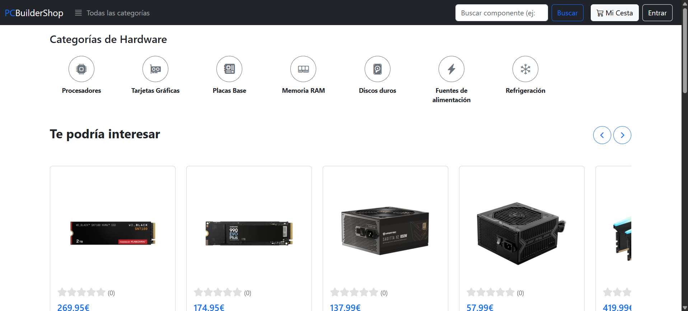

#### **RESTO DE PÁGINAS**

#### **TODOS LOS USUARIOS**

#### **2. Pagina de busqueda:**

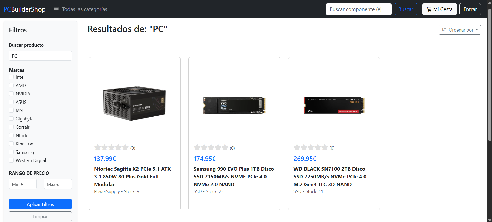

#### **3. Pagina de Producto:**

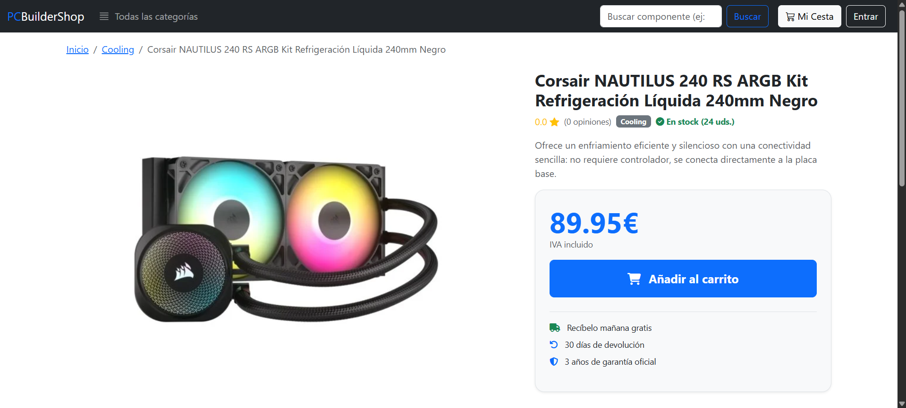

#### **4. Pagina de Login:**

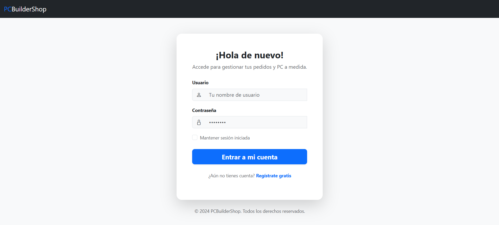

#### **5. Pagina de Registro:**

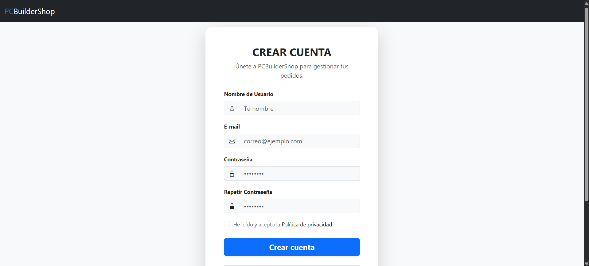

#### **USUARIOS REGISTRADOS**

#### **6. Pagina de Perfil:**

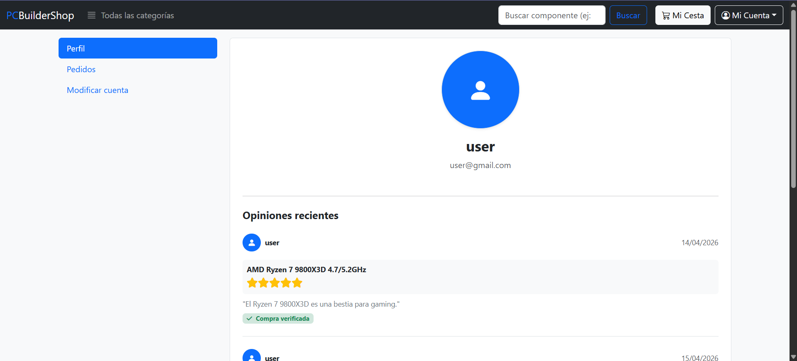
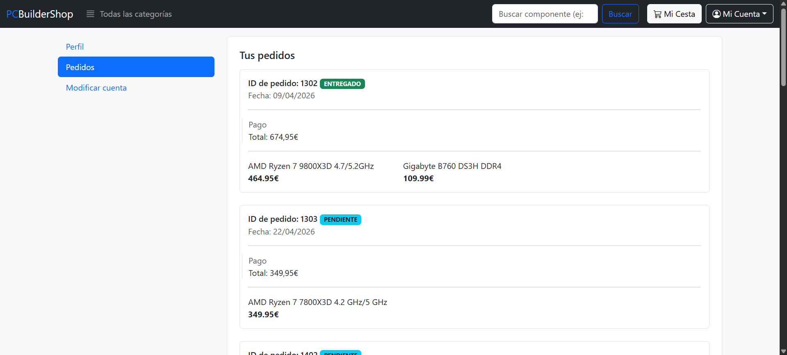
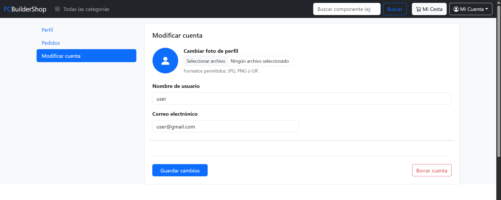

#### **7. Pagina de Carrito:**

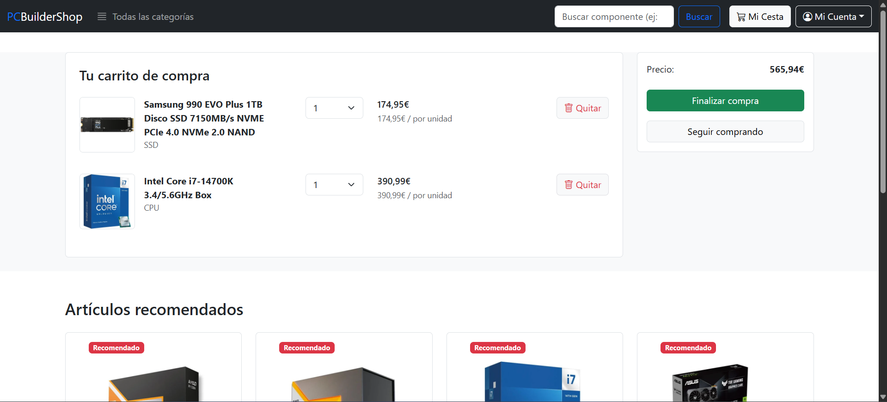

#### **8. Pagina de Pago Correcto:**

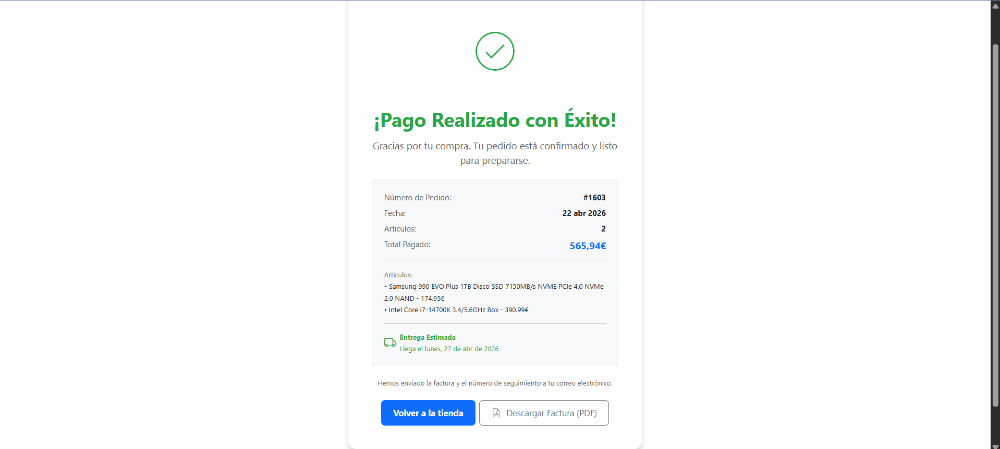

#### **9. Pagina de Crear Review:**

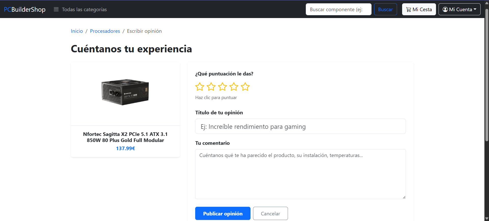

#### **ADMINISTRADOR**

#### **10. Pagina de Lista Pedidos:**

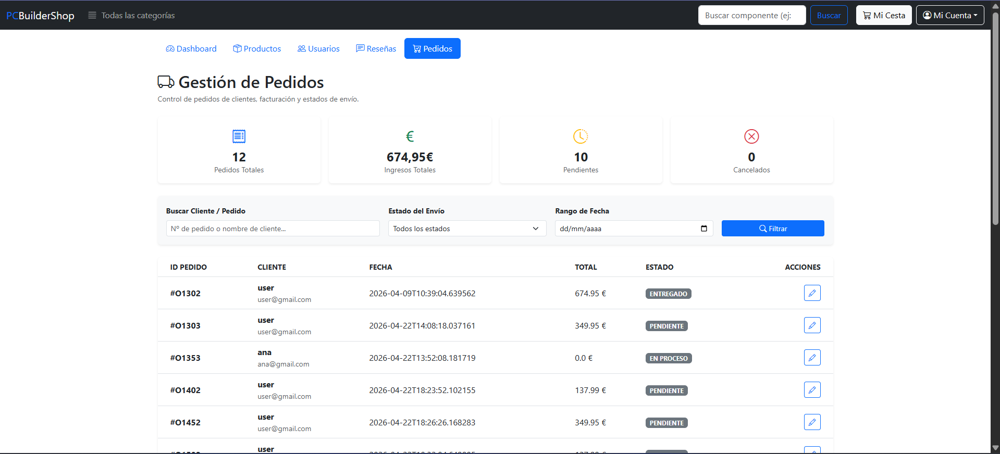

### **11. Pagina de Editar Pedidos:**

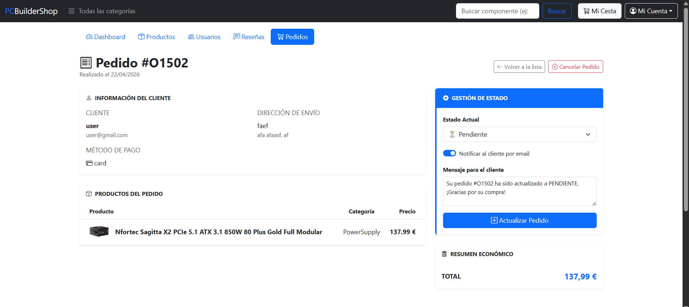


### **Instrucciones de Ejecución**

#### **Requisitos Previos**
- **Java**: versión 21 o superior
- **Maven**: versión 3.8 o superior
- **MySQL**: versión 8.0 o superior
- **Git**: para clonar el repositorio

#### **Pasos para ejecutar la aplicación**

1. **Clonar el repositorio**
   ```bash
   git clone https://github.com/[usuario]/[nombre-repositorio].git
   cd [nombre-repositorio]
   ```

2. **Configura la Base de Datos(MySQL)**
   1. Abre MySQL Workbench
   2. Ejecuta el siguiente comando SQL para crear la base de datos necesaria:
   ```bash
   CREATE DATABASE pc_builder_db;
   ```
   3. Dirígete al archivo de configuración en el código fuente: src/main/resources/application.properties
   4. Asegúrate de que las credenciales coincidan con las de tu servidor MySQL local:
   ```bash
   spring.datasource.url=jdbc:mysql://localhost:3306/pc_builder_db
   spring.datasource.username=TU_USUARIO_AQUI
   spring.datasource.password=TU_CONTRASEÑA_AQUI
   ```
3. **Ejecutar el servidor**
   
   Se puede ejecutar la aplicación de dos maneras distintas:
   
   Opción A: Desde el IDE 
   Localiza el archivo principal src/main/java/com/example/backend/BackendApplication.java y ejecútalo (botón de Run o Play).

   Opción B: Desde la Terminal usando Maven
   instalado en tu sistema, asegúrate de estar en el directorio raíz del proyecto y ejecuta:
   ```bash
   mvn clean install
   mvn spring-boot:run
   ```
4. **Acceder a la web**

   Cuando el servidor este arrancando y lo sabras porque veras el mensaje "Started BackendApplication in ... seconds" en la consola, abre tu navegador web y dirigete a : https://localhost:8443

#### **Credenciales de prueba**
- **Usuario Admin**: usuario: `admin`, contraseña: `password`
- **Usuario Registrado**: usuario: `user`, contraseña: `password`

### **Diagrama de Entidades de Base de Datos**

Diagrama mostrando las entidades, sus campos y relaciones:

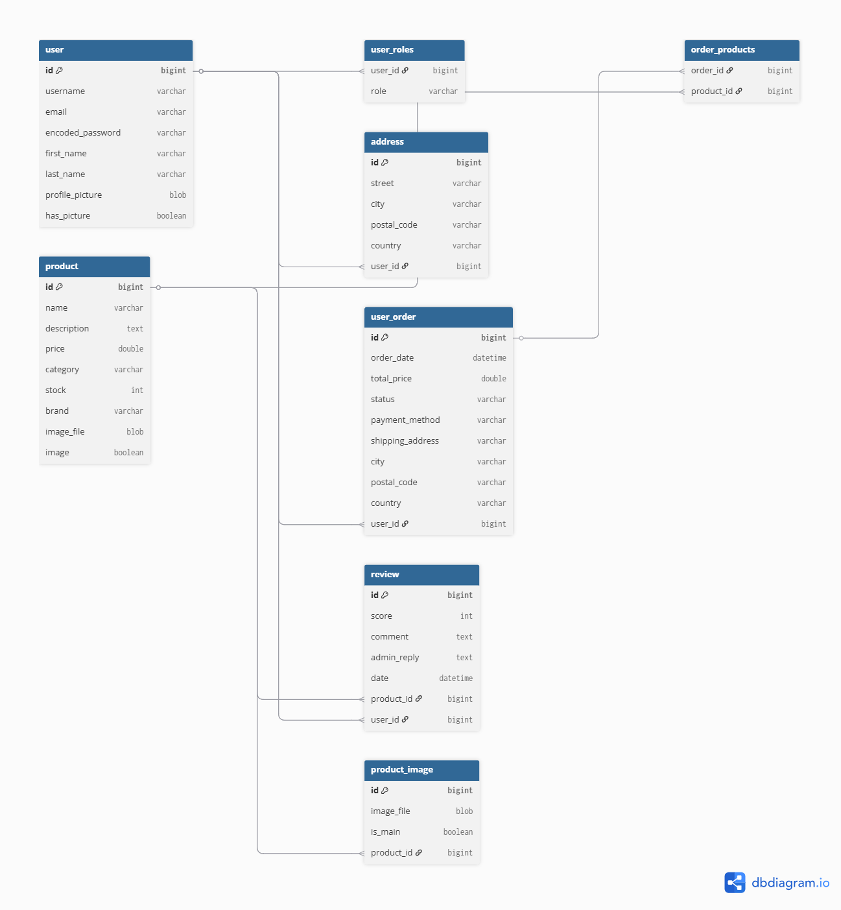

> Este modelo relacional organiza la plataforma mediante las entidades User (clientes y roles), Product (catálogo e imágenes) y Order (ventas y envíos). Se establecen relaciones 1:N entre usuarios y sus direcciones (Address), pedidos y reseñas (Review), mientras que la tabla intermedia order_products gestiona la relación N:M entre pedidos y productos.

### **Diagrama de Clases y Templates**

Diagrama de clases de la aplicación con diferenciación por colores o secciones:

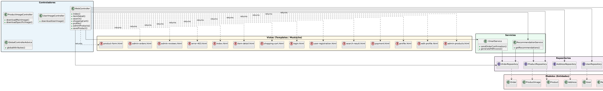

### **Participación de Miembros en la Práctica 2**

#### **Alumno 1 - Ramiro Daniel Flores Aquino**

Me encargue de la implementación de la instalacion de la arquitectura base de la aplicación(backend) junto con el sistema de seguridad central (security), también fui responsanle de las pantallas de error (404y 403) y la persistencia de usuarios incluyendo la integración con MySQL cifrando contraseñas.

| Nº    | Commits      | Files      |
|:------------: |:------------:| :------------:|
|1| [Implementación de la arquitectura base y estructura del backend](https://github.com/CodeURJC-SSDD-2025-26/practica-ssdd-2025-26-grupo-4/commit/4fac3a156e215943d28061bbb8f06e055bc9d43e)  | [pom.xml](https://github.com/CodeURJC-SSDD-2025-26/practica-ssdd-2025-26-grupo-4/blob/main/backend/pom.xml)   , [BackendApplication.java](https://github.com/CodeURJC-SSDD-2025-26/practica-ssdd-2025-26-grupo-4/blob/main/backend/src/main/java/com/example/backend/BackendApplication.java)
|2| [Configuración de Spring Security y enrutado de accesos públicos/privados](https://github.com/CodeURJC-SSDD-2025-26/practica-ssdd-2025-26-grupo-4/commit/00b1d55306fc963153645121c918cbbe5f28ce8a2)  | [SecurityConfig.java](https://github.com/CodeURJC-SSDD-2025-26/practica-ssdd-2025-26-grupo-4/blob/main/backend/src/main/java/com/example/backend/security/SecurityConfig.java)   | 
|3| [Desarrollo del sistema de registro de usuarios y validación en base de datos](https://github.com/CodeURJC-SSDD-2025-26/practica-ssdd-2025-26-grupo-4/commit/b5269b1b53e0c05bf36dd8a968af7901fbe6f411)  | [User.java](https://github.com/CodeURJC-SSDD-2025-26/practica-ssdd-2025-26-grupo-4/blob/main/backend/src/main/java/com/example/backend/models/User.java) ,[UserRepository.java](https://github.com/CodeURJC-SSDD-2025-26/practica-ssdd-2025-26-grupo-4/blob/main/backend/src/main/java/com/example/backend/repositories/UserRepository.java)   , [CustomUserDetailsService.java](https://github.com/CodeURJC-SSDD-2025-26/practica-ssdd-2025-26-grupo-4/blob/main/backend/src/main/java/com/example/backend/security/CustomUserDetailsService.java)
|4| [Implementación de controladores y vistas personalizadas para errores HTTP](https://github.com/CodeURJC-SSDD-2025-26/practica-ssdd-2025-26-grupo-4/commit/6b2bd966af8e3b3a5ed3eb18ed79f85c65f18334)  | [WebController.java](https://github.com/CodeURJC-SSDD-2025-26/practica-ssdd-2025-26-grupo-4/blob/main/backend/src/main/java/com/example/backend/controllers/WebController.java)   , [error.html](https://github.com/CodeURJC-SSDD-2025-26/practica-ssdd-2025-26-grupo-4/blob/main/backend/src/main/resources/templates/error.html) , [error-403.html](https://github.com/CodeURJC-SSDD-2025-26/practica-ssdd-2025-26-grupo-4/blob/main/backend/src/main/resources/templates/error-403.html)
|5| [Configuración de la persistencia de datos y conexión con MySQL local](https://github.com/CodeURJC-SSDD-2025-26/practica-ssdd-2025-26-grupo-4/commit/f1f2c551cbddd223db737a3df08a8a90b30eed6a#diff-b357bac448d6dbc289cd88013dbf9cc867b6f020f90752c84719856323bb6c0a)  | [application.properties](https://github.com/CodeURJC-SSDD-2025-26/practica-ssdd-2025-26-grupo-4/blob/main/backend/src/main/resources/application.properties)   |

---

#### **Alumno 2 - David Díaz Gómez-Escalonilla**

Responsable de la gestión integral de productos, desde el diseño del modelo de datos y repositorios hasta la interfaz de usuario. Implementé el motor de búsqueda con filtros, el algoritmo de recomendación y la lógica de negocio para la generación de PDFs y envío de correos automatizados. También desarrollé el sistema de carga de imágenes y la inicialización de la base de datos, ademas de generar los diagramas de entidades y los diagramas de templates.
| Nº    | Commits      | Files      |
|:------------: |:------------:| :------------:|
|1| [Creacion e implementacion de los models de las entidades](https://github.com/CodeURJC-SSDD-2025-26/practica-ssdd-2025-26-grupo-4/commit/a720f1acdfd70596862f8545892b78880da0d42f)  | [Order.java](https://github.com/CodeURJC-SSDD-2025-26/practica-ssdd-2025-26-grupo-4/blob/a720f1acdfd70596862f8545892b78880da0d42f/backend/src/main/java/com/example/backend/models/Order.java), [Product.java](https://github.com/CodeURJC-SSDD-2025-26/practica-ssdd-2025-26-grupo-4/blob/a720f1acdfd70596862f8545892b78880da0d42f/backend/src/main/java/com/example/backend/models/Product.java), [Review.java](https://github.com/CodeURJC-SSDD-2025-26/practica-ssdd-2025-26-grupo-4/blob/a720f1acdfd70596862f8545892b78880da0d42f/backend/src/main/java/com/example/backend/models/Review.java), [User.java](https://github.com/CodeURJC-SSDD-2025-26/practica-ssdd-2025-26-grupo-4/blob/a720f1acdfd70596862f8545892b78880da0d42f/backend/src/main/java/com/example/backend/models/User.java)
|2| [Creacion e implementacion de los repositories de las entidades](https://github.com/CodeURJC-SSDD-2025-26/practica-ssdd-2025-26-grupo-4/commit/254229c71926d09243faae2600f541d55ec2ff7f)  | [OrderRepository.java](https://github.com/CodeURJC-SSDD-2025-26/practica-ssdd-2025-26-grupo-4/blob/254229c71926d09243faae2600f541d55ec2ff7f/backend/src/main/java/com/example/backend/repositories/OrderRepository.java), [ProductRepository.java](https://github.com/CodeURJC-SSDD-2025-26/practica-ssdd-2025-26-grupo-4/blob/254229c71926d09243faae2600f541d55ec2ff7f/backend/src/main/java/com/example/backend/repositories/ProductRepository.java), [ReviewRepository.java](https://github.com/CodeURJC-SSDD-2025-26/practica-ssdd-2025-26-grupo-4/blob/254229c71926d09243faae2600f541d55ec2ff7f/backend/src/main/java/com/example/backend/repositories/ReviewRepository.java), [UserRepository.java](https://github.com/CodeURJC-SSDD-2025-26/practica-ssdd-2025-26-grupo-4/blob/254229c71926d09243faae2600f541d55ec2ff7f/backend/src/main/java/com/example/backend/repositories/UserRepository.java)
|3| [Creacion e implementacion inicial de DatabaseInitializer](https://github.com/CodeURJC-SSDD-2025-26/practica-ssdd-2025-26-grupo-4/commit/b1c7a03f7a5a593108db13911a0ad6bb0aa7390a)  | [DatabaseInitializer.java](https://github.com/CodeURJC-SSDD-2025-26/practica-ssdd-2025-26-grupo-4/blob/b1c7a03f7a5a593108db13911a0ad6bb0aa7390a/backend/src/main/java/com/example/backend/services/DatabaseInitializer.java)   |
|4| [Creacion e implementacion inicial de ProductImageController + ejemplos en DatabaseInitializer](https://github.com/CodeURJC-SSDD-2025-26/practica-ssdd-2025-26-grupo-4/commit/fa7bb08a1abaee137308bcc51ee247387a0784a8#diff-0da45d5c232136f9ee861f930f176837ff97b0daef51012b71204cb375edb5f8)  | [ProductImageController.java](https://github.com/CodeURJC-SSDD-2025-26/practica-ssdd-2025-26-grupo-4/blob/fa7bb08a1abaee137308bcc51ee247387a0784a8/backend/src/main/java/com/controllers/ProductImageController.java), [DatabaseInitializer.java](https://github.com/CodeURJC-SSDD-2025-26/practica-ssdd-2025-26-grupo-4/blob/fa7bb08a1abaee137308bcc51ee247387a0784a8/backend/src/main/java/com/example/backend/services/DatabaseInitializer.java)
|5| [Creacion de ProductImage](https://github.com/CodeURJC-SSDD-2025-26/practica-ssdd-2025-26-grupo-4/commit/6ed4b0725eeca64efcdb4ed2a4d7512ee73643e9)  | [ProductImage.java](https://github.com/CodeURJC-SSDD-2025-26/practica-ssdd-2025-26-grupo-4/blob/6ed4b0725eeca64efcdb4ed2a4d7512ee73643e9/backend/src/main/java/com/example/backend/models/ProductImage.java)
|6| [Añadir mas ejemplos en DatabaseInitializer](https://github.com/CodeURJC-SSDD-2025-26/practica-ssdd-2025-26-grupo-4/blob/738adc739475644f5ed8964123c9bcb3367d8773/backend/src/main/java/com/example/backend/services/DatabaseInitializer.java)  | [DatabaseInitializer.java](https://github.com/CodeURJC-SSDD-2025-26/practica-ssdd-2025-26-grupo-4/blob/738adc739475644f5ed8964123c9bcb3367d8773/backend/src/main/java/com/example/backend/services/DatabaseInitializer.java)
|7| [Implementacion de busqueda de productos + filtros y sort](https://github.com/CodeURJC-SSDD-2025-26/practica-ssdd-2025-26-grupo-4/commit/d1a120c83f4e766688b376afbd5fff9ec5bc9f70)  | [WebController.java](https://github.com/CodeURJC-SSDD-2025-26/practica-ssdd-2025-26-grupo-4/blob/d1a120c83f4e766688b376afbd5fff9ec5bc9f70/backend/src/main/java/com/example/backend/controllers/WebController.java), [ProductRepository.java](https://github.com/CodeURJC-SSDD-2025-26/practica-ssdd-2025-26-grupo-4/blob/d1a120c83f4e766688b376afbd5fff9ec5bc9f70/backend/src/main/java/com/example/backend/repositories/ProductRepository.java), [search-result.html](https://github.com/CodeURJC-SSDD-2025-26/practica-ssdd-2025-26-grupo-4/blob/d1a120c83f4e766688b376afbd5fff9ec5bc9f70/backend/src/main/resources/templates/pages/search-result.html), [loged_header.html](https://github.com/CodeURJC-SSDD-2025-26/practica-ssdd-2025-26-grupo-4/blob/d1a120c83f4e766688b376afbd5fff9ec5bc9f70/backend/src/main/resources/templates/partials/headers/loged_header.html), [unloged_header.html](https://github.com/CodeURJC-SSDD-2025-26/practica-ssdd-2025-26-grupo-4/blob/d1a120c83f4e766688b376afbd5fff9ec5bc9f70/backend/src/main/resources/templates/partials/headers/unloged_header.html)
|8| [Implementacion de la busqueda de terminos](https://github.com/CodeURJC-SSDD-2025-26/practica-ssdd-2025-26-grupo-4/commit/d4c349dc265ac872c9e5b01d82fd56421892325c)  | [WebController.java](https://github.com/CodeURJC-SSDD-2025-26/practica-ssdd-2025-26-grupo-4/blob/d4c349dc265ac872c9e5b01d82fd56421892325c/backend/src/main/java/com/example/backend/controllers/WebController.java), [search-result.html](https://github.com/CodeURJC-SSDD-2025-26/practica-ssdd-2025-26-grupo-4/blob/d4c349dc265ac872c9e5b01d82fd56421892325c/backend/src/main/resources/templates/pages/search-result.html)
|9| [Implementacion puntuacion media en productos](https://github.com/CodeURJC-SSDD-2025-26/practica-ssdd-2025-26-grupo-4/commit/05456816c800d6e35374c03e45e20c89f933c0a2)  | [Product.java](https://github.com/CodeURJC-SSDD-2025-26/practica-ssdd-2025-26-grupo-4/blob/05456816c800d6e35374c03e45e20c89f933c0a2/backend/src/main/java/com/example/backend/models/Product.java), [index.html](https://github.com/CodeURJC-SSDD-2025-26/practica-ssdd-2025-26-grupo-4/blob/05456816c800d6e35374c03e45e20c89f933c0a2/backend/src/main/resources/templates/index.html), [item-detail.html](https://github.com/CodeURJC-SSDD-2025-26/practica-ssdd-2025-26-grupo-4/blob/05456816c800d6e35374c03e45e20c89f933c0a2/backend/src/main/resources/templates/pages/item-detail.html), [search-result.html](https://github.com/CodeURJC-SSDD-2025-26/practica-ssdd-2025-26-grupo-4/blob/05456816c800d6e35374c03e45e20c89f933c0a2/backend/src/main/resources/templates/pages/search-result.html)
|10| [Implementacion algoritmo de recomendacion de productos (1)](https://github.com/CodeURJC-SSDD-2025-26/practica-ssdd-2025-26-grupo-4/commit/8d5ca9762d18d969050a4620982eef10dc9837c5)  | [WebController.java](https://github.com/CodeURJC-SSDD-2025-26/practica-ssdd-2025-26-grupo-4/blob/8d5ca9762d18d969050a4620982eef10dc9837c5/backend/src/main/java/com/example/backend/controllers/WebController.java), [index.html](https://github.com/CodeURJC-SSDD-2025-26/practica-ssdd-2025-26-grupo-4/blob/8d5ca9762d18d969050a4620982eef10dc9837c5/backend/src/main/resources/templates/index.html)
|| [Implementacion algoritmo de recomendacion de productos (2)](https://github.com/CodeURJC-SSDD-2025-26/practica-ssdd-2025-26-grupo-4/commit/a5011f57c3a2f70cbd89157c6043327dc0ce75d0)  | [RecommendationService.java](https://github.com/CodeURJC-SSDD-2025-26/practica-ssdd-2025-26-grupo-4/blob/a5011f57c3a2f70cbd89157c6043327dc0ce75d0/backend/src/main/java/com/example/backend/services/RecommendationService.java)
|11| [Generar pdfs + enviar email con pdf adjunto](https://github.com/CodeURJC-SSDD-2025-26/practica-ssdd-2025-26-grupo-4/commit/7ea1a82a4715b1c76de74e95a113cab3d6c0abe5)  | [pom.xml](https://github.com/CodeURJC-SSDD-2025-26/practica-ssdd-2025-26-grupo-4/blob/7ea1a82a4715b1c76de74e95a113cab3d6c0abe5/backend/pom.xml), [WebController.java](https://github.com/CodeURJC-SSDD-2025-26/practica-ssdd-2025-26-grupo-4/blob/7ea1a82a4715b1c76de74e95a113cab3d6c0abe5/backend/src/main/java/com/example/backend/controllers/WebController.java), [EmailService.java](https://github.com/CodeURJC-SSDD-2025-26/practica-ssdd-2025-26-grupo-4/blob/7ea1a82a4715b1c76de74e95a113cab3d6c0abe5/backend/src/main/java/com/example/backend/services/EmailService.java), [application.properties](https://github.com/CodeURJC-SSDD-2025-26/practica-ssdd-2025-26-grupo-4/blob/7ea1a82a4715b1c76de74e95a113cab3d6c0abe5/backend/src/main/resources/application.properties), [payment-correct.html](https://github.com/CodeURJC-SSDD-2025-26/practica-ssdd-2025-26-grupo-4/blob/7ea1a82a4715b1c76de74e95a113cab3d6c0abe5/backend/src/main/resources/templates/pages/payment-correct.html), [payment.html](https://github.com/CodeURJC-SSDD-2025-26/practica-ssdd-2025-26-grupo-4/blob/7ea1a82a4715b1c76de74e95a113cab3d6c0abe5/backend/src/main/resources/templates/pages/payment.html)
---

#### **Alumno 3 - Jonay Sebastián Ortiz Armas**

Principal responsable de la navegación entre páginas con el WebController y del control de acceso por dueño en los endpoints, además de pequeños ajustes en la página de carrito, de pago y de registro.

| Nº | Commits | Files |
|:---:|:---|:---|
| 1 | [Añadir páginas básicas al Controller e implementar navegación](https://github.com/CodeURJC-SSDD-2025-26/ssdd-2025-26-project-base/commit/70b9a5b91a99fe5f9cb0dc0ddb87e998f3e3cda1) | [WebController.java](https://github.com/CodeURJC-SSDD-2025-26/ssdd-2025-26-project-base/blob/70b9a5b91a99fe5f9cb0dc0ddb87e998f3e3cda1/backend/src/main/java/com/example/backend/WebController.java) |
| 2 | [Añadir funcionalidad de direcciones a la página de pago](https://github.com/CodeURJC-SSDD-2025-26/ssdd-2025-26-project-base/commit/47ffc0394bdd3af9b3eea7b6e17ff3531fca0c04) | [payment.html](https://github.com/CodeURJC-SSDD-2025-26/ssdd-2025-26-project-base/blob/47ffc0394bdd3af9b3eea7b6e17ff3531fca0c04/backend/src/main/resources/templates/pages/payment.html) |
| 3 | [Arreglar shopping-cart (nº de unidades de cada producto, actualizar precio, checkear que haya algún producto seleccionado antes de iniciar el pago)](https://github.com/CodeURJC-SSDD-2025-26/ssdd-2025-26-project-base/commit/5f6d2fc9ca1dd38771fbb92273a85f577090260e) | [WebController.java](https://github.com/CodeURJC-SSDD-2025-26/ssdd-2025-26-project-base/blob/70b9a5b91a99fe5f9cb0dc0ddb87e998f3e3cda1/backend/src/main/java/com/example/backend/WebController.java) |
| 4 | [Añadir control de acceso por dueño del objeto](https://github.com/CodeURJC-SSDD-2025-26/ssdd-2025-26-project-base/commit/46938b821995fcb591ffbba340d0044dc9c4fbef) | [WebController.java](https://github.com/CodeURJC-SSDD-2025-26/ssdd-2025-26-project-base/blob/70b9a5b91a99fe5f9cb0dc0ddb87e998f3e3cda1/backend/src/main/java/com/example/backend/WebController.java) |
| 5 | [Añadir revisión en backend en el registro](https://github.com/CodeURJC-SSDD-2025-26/ssdd-2025-26-project-base/commit/02a0df780ec91780f551b4d7c48caa5753bc2292) | [WebController.java](https://github.com/CodeURJC-SSDD-2025-26/ssdd-2025-26-project-base/blob/70b9a5b91a99fe5f9cb0dc0ddb87e998f3e3cda1/backend/src/main/java/com/example/backend/WebController.java) |

---

#### **Alumno 4 - Joel Domené Álvaro**

Principal responsable de la gestión dinámica del contenido, vinculación de los botones y acciones del panel de administración con modificaciones a la base de datos y del sistema de búsqueda y filtros de productos.

| Nº    | Commits      | Files      |
|:------------: |:------------:| :------------:|
|1| [Generación del contenido dinámico](https://github.com/CodeURJC-SSDD-2025-26/practica-ssdd-2025-26-grupo-4/compare/4ba1a49c23016ec193cc12d251b058220fb90af6...b4b37c52b9bb8432fcccf50aa3cd9a944c110234)  | [WebController.java](https://github.com/CodeURJC-SSDD-2025-26/ssdd-2025-26-project-base/blob/70b9a5b91a99fe5f9cb0dc0ddb87e998f3e3cda1/backend/src/main/java/com/example/backend/WebController.java)  |
|2| [Sistema de filtros y búsqueda y generación de contenido dinámico del carrito y del usuario](https://github.com/CodeURJC-SSDD-2025-26/practica-ssdd-2025-26-grupo-4/compare/6abd459e8ae2603c1a4fa0d5282652d8f5dd8ac8...134ce59cf3c7390606cb466a3421eb37a08f1d08)  | [shopping-cart.html](https://github.com/CodeURJC-SSDD-2025-26/practica-ssdd-2025-26-grupo-4/blob/main/backend/src/main/resources/templates/pages/shopping-cart.html)   |
|1/2|  | [search-result.html](https://github.com/CodeURJC-SSDD-2025-26/practica-ssdd-2025-26-grupo-4/blob/main/backend/src/main/resources/templates/pages/search-result.html)   |
|1/2|  | [index.html](https://github.com/CodeURJC-SSDD-2025-26/practica-ssdd-2025-26-grupo-4/blob/main/index.html)  |
|1/2| [Varias páginas de administrador] | [pages/admin](https://github.com/CodeURJC-SSDD-2025-26/practica-ssdd-2025-26-grupo-4/tree/main/backend/src/main/resources/templates/pages/admin)   |

---

#### **Documentación de la API REST**

La API REST de `app-service` está documentada mediante OpenAPI generado con SpringDoc. La especificación OpenAPI se genera a partir de los controladores REST del proyecto y se incluye en la carpeta `api-docs`.

- [Especificación OpenAPI YAML](api-docs/apidocs.yaml)
- [Documentación HTML de la API REST](https://raw.githack.com/CodeURJC-SSDD-2025-26/practica-ssdd-2025-26-grupo-4/main/api-docs/api-docs.html)

Durante la ejecución local, la documentación también puede consultarse en:

```text
https://localhost:8443/api-docs
https://localhost:8443/swagger-ui/index.html
```

### **Diagrama de Clases y Templates Actualizado**

Diagrama actualizado incluyendo los @RestController y su relación con los @Service compartidos:

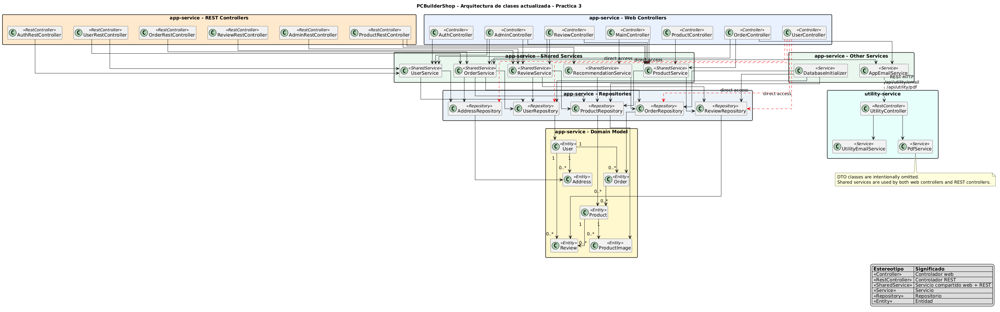


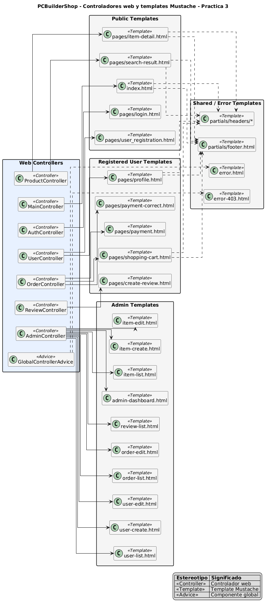

### **Diagrama de Servicios**

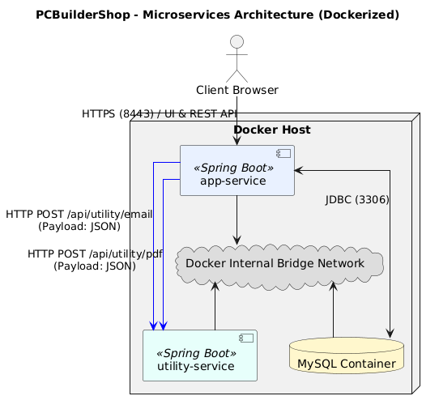


### **Instrucciones de Ejecución con Docker**

#### **Requisitos previos:**
- Docker instalado (versión 20.10 o superior)
- Docker Compose instalado (versión 2.0 o superior)

#### **Pasos para ejecutar con docker-compose:**

1. **Clonar el repositorio** (si no lo has hecho ya):
   ```bash
   git clone https://github.com/[usuario]/[repositorio].git
   cd [repositorio]
   ```

2. **Acceder al directorio donde se encuentra el fichero `docker-compose.yml`**

3. **Iniciar los contenedores**:
   ```bash
   docker compose up --build
   ```

   O en segundo plano:
   ```bash
   docker compose up -d --build
   ```

4. **Verificar que todos los servicios están funcionando correctamente**:
   ```bash
   docker ps
   ```

   Deberían aparecer los siguientes contenedores:
   - `db`
   - `app-service`
   - `utility-service`

5. **Esperar a que la base de datos pase el healthcheck**:

   El servicio `app-service` y `utility-service` no arrancarán hasta que MySQL esté completamente disponible.

6. **Acceder a la aplicación web**:

   Abrir en el navegador:
   ```
   https://localhost:8443
   ```

7. **Acceder al servicio utility-service** (opcional):
   ```
   http://localhost:8080
   ```

8. **Detener los contenedores**:
   ```bash
   docker compose down
   ```

### **Construcción de la Imagen Docker**

#### **Requisitos:**
- Docker instalado en el sistema

#### **Pasos para construir y publicar la imagen:**

1. **Navegar al directorio de Docker**:
   ```bash
   cd docker
   ```


2. **Construir las imágenes Docker de los servicios**:
   ```bash
   docker compose build
   ```

   También es posible construir las imágenes individualmente:
   ```bash
   docker build -t [usuario-dockerhub]/app-service:latest ./app-service
   docker build -t [usuario-dockerhub]/utility-service:latest ./utility-service
   ```

3. **Verificar que las imágenes se han creado correctamente**:
   ```bash
   docker images
   ```

4. **Iniciar sesión en DockerHub**:
   ```bash
   docker login
   ```

5. **Publicar la imagen del servicio principal (`app-service`)**:
   ```bash
   docker push [usuario-dockerhub]/app-service:latest
   ```

8. **Publicar la imagen del servicio auxiliar (`utility-service`)**:
   ```bash
   docker push [usuario-dockerhub]/utility-service:latest
   ```

9. **Verificar que las imágenes han sido publicadas correctamente**:

   Acceder al perfil de DockerHub:
   ```
   https://hub.docker.com/u/[usuario-dockerhub]
   ```

### **Despliegue de la aplicación desde un OCI Artifact**

Este método permite desplegar la aplicación directamente utilizando el artefacto publicado en DockerHub, sin necesidad de tener el archivo `docker-compose.yml` de forma local.

1. **Lanzar la aplicación**:
   Ejecuta el siguiente comando:
   ```bash
   docker compose -f oci://docker.io/[usuario-dockerhub]/pcbuildershop-compose up
   ```

Este comando descarga automáticamente la configuración del artefacto OCI y levanta todos los servicios definidos en él.


### **Publicación de la aplicación como OCI Artifact**

Este método permite publicar la configuración de despliegue sin necesidad de construir nuevas imágenes y sin usar *binding* de carpetas.

1. **Situarse en la carpeta raíz**:
   Debes estar en el directorio donde se encuentra el fichero `docker-compose.yml`.

2. **Iniciar sesión en DockerHub**:
   ```bash
   docker login
   ```

3. **Publicar el fichero en el repositorio**:
   Ejecuta el siguiente comando para publicar el artefacto:
   ```bash
   docker compose publish [usuario-dockerhub]/pcbuildershop-compose
   ```

4. **Verificación**:
   Una vez publicado, puedes revisar tus artefactos de tipo Compose en tu perfil de DockerHub.

### **Despliegue en Máquina Virtual**

#### **Requisitos:**
- Acceso a la máquina virtual (SSH)
- Clave privada para autenticación
- Conexión a la red correspondiente o VPN configurada

#### **Pasos para desplegar:**

1. **Conectar a la máquina virtual**:
   ```bash
   ssh -i [ruta/a/clave.key] [usuario]@[IP-o-dominio-VM]
   ```
   
   Ejemplo:
   ```bash
   ssh -i ssh-keys/app.key vmuser@10.100.139.XXX
   ```

2. **Verificar que Docker y Docker Compose están instalados**:
   ```bash
   docker --version
   docker compose version
   ```

3. **Clonar el repositorio del proyecto**:
   ```bash
   git clone https://github.com/[usuario]/[repositorio].git
   cd [repositorio]
   ```

4. **Iniciar los contenedores en la máquina virtual**:
   ```bash
   docker compose up -d --build
   ```

5. **Comprobar que todos los servicios están funcionando correctamente**:
   ```bash
   docker ps
   ```

   Deberían aparecer los siguientes contenedores:
   - `db`
   - `app-service`
   - `utility-service`

6. **Consultar logs en caso de error**:
   ```bash
   docker compose logs -f
   ```

7. **Acceder a la aplicación desplegada**:

   Desde un navegador web:
   ```
   https://[IP-o-dominio-VM]:8443
   ```

8. **Detener el despliegue** (opcional):
   ```bash
   docker compose down
   ```
### **URL de la Aplicación Desplegada**

🌐 **URL de acceso**: `https://[nombre-app].etsii.urjc.es:8443`

#### **Credenciales de Usuarios de Ejemplo**

| Rol | Usuario | Contraseña |
|:---|:---|:---|
| Administrador | admin | admin123 |
| Usuario Registrado | user1 | user123 |
| Usuario Registrado | user2 | user123 |

### **OTRA DOCUMENTACIÓN ADICIONAL REQUERIDA EN LA PRÁCTICA**

### **Participación de Miembros en la Práctica 3**

#### **Alumno 1 - Ramiro Daniel Flores Aquino**

Me encargué de refactorizar la arquitectura moviendo la lógica de los controladores a servicios y protegiendo la API mediante DTOs para evitar la exposición de datos sensibles.  Documentación del despliegue mediante el artefacto OCI publicado en DockerHub.
| Nº    | Commits      | Files      |
|:------------: |:------------:| :------------:|
|1| [Cambios de nombres de carpetas](https://github.com/CodeURJC-SSDD-2025-26/practica-ssdd-2025-26-grupo-4/commit/d69e6d964734377e78d33709b067e04c5f1ee39f)  | [app-service](https://github.com/CodeURJC-SSDD-2025-26/practica-ssdd-2025-26-grupo-4/tree/main/app-service)   |
|2| [Implementacion de DTOs para la API REST](https://github.com/CodeURJC-SSDD-2025-26/practica-ssdd-2025-26-grupo-4/commit/6dc2d703491e96b5cc84b4d44fc0488905cd497f)  | [OrderDTO.java](https://github.com/CodeURJC-SSDD-2025-26/practica-ssdd-2025-26-grupo-4/blob/main/app-service/src/main/java/com/example/backend/dto/OrderDTO.java)  , [ProductDTO.java](https://github.com/CodeURJC-SSDD-2025-26/practica-ssdd-2025-26-grupo-4/blob/main/app-service/src/main/java/com/example/backend/dto/ProductDTO.java)
|3| [Instrucciones de ejecución de imágenes y OCI Artifact](https://github.com/CodeURJC-SSDD-2025-26/practica-ssdd-2025-26-grupo-4/commit/1882e662896794e6ced6a3db749367b0ab1f474e)  | [README.md](https://github.com/CodeURJC-SSDD-2025-26/practica-ssdd-2025-26-grupo-4/blob/main/README.md)   |

---

#### **Alumno 2 - David Díaz Gómez-Escalonilla**

Desarrollo de utility-service e implementacion de la generación de PDF y el envío de correos mediante una API REST.
Responsable de la integración entre microservicios, adaptando el app-service para consumir este servicio.
Elaboración de la documentación OpenAPI de los endpoints y de los diagrama de clases actualizado y del diagrama de servicios

| Nº    | Commits      | Files      |
|:------------: |:------------:| :------------:|
|1| [Creacion de utility-service](https://github.com/CodeURJC-SSDD-2025-26/practica-ssdd-2025-26-grupo-4/commit/1afdf887d29ba87e655b25f75f04e4b49857bce7)  | []()   |
|2| [Implementacion servicio correo electrónico y PDF en utility-service](https://github.com/CodeURJC-SSDD-2025-26/practica-ssdd-2025-26-grupo-4/commit/d4af331a55ae900a5b3cc71ed8410e8d3fdcb5b9)  | [pom.xml](https://github.com/CodeURJC-SSDD-2025-26/practica-ssdd-2025-26-grupo-4/blob/d4af331a55ae900a5b3cc71ed8410e8d3fdcb5b9/utility-service/pom.xml), [UtilityController.java](https://github.com/CodeURJC-SSDD-2025-26/practica-ssdd-2025-26-grupo-4/blob/d4af331a55ae900a5b3cc71ed8410e8d3fdcb5b9/utility-service/src/main/java/com/example/utility_service/controller/UtilityController.java), [GlobalExceptionHandler.java](https://github.com/CodeURJC-SSDD-2025-26/practica-ssdd-2025-26-grupo-4/blob/d4af331a55ae900a5b3cc71ed8410e8d3fdcb5b9/utility-service/src/main/java/com/example/utility_service/exception/GlobalExceptionHandler.java), [PdfRequest.java](https://github.com/CodeURJC-SSDD-2025-26/practica-ssdd-2025-26-grupo-4/blob/d4af331a55ae900a5b3cc71ed8410e8d3fdcb5b9/utility-service/src/main/java/com/example/utility_service/model/PdfRequest.java), [EmailService.java](https://github.com/CodeURJC-SSDD-2025-26/practica-ssdd-2025-26-grupo-4/blob/d4af331a55ae900a5b3cc71ed8410e8d3fdcb5b9/utility-service/src/main/java/com/example/utility_service/service/EmailService.java), [PdfService.java](https://github.com/CodeURJC-SSDD-2025-26/practica-ssdd-2025-26-grupo-4/blob/d4af331a55ae900a5b3cc71ed8410e8d3fdcb5b9/utility-service/src/main/java/com/example/utility_service/service/PdfService.java), [application.properties](https://github.com/CodeURJC-SSDD-2025-26/practica-ssdd-2025-26-grupo-4/blob/d4af331a55ae900a5b3cc71ed8410e8d3fdcb5b9/utility-service/src/main/resources/application.properties), [PdfServiceTests](https://github.com/CodeURJC-SSDD-2025-26/practica-ssdd-2025-26-grupo-4/blob/d4af331a55ae900a5b3cc71ed8410e8d3fdcb5b9/utility-service/src/test/java/com/example/utility_service/PdfServiceTests.java)
|3| [Refactorizacion EmailService para usar la API REST de servicios de utilidad y adjuntar archivos PDF](https://github.com/CodeURJC-SSDD-2025-26/practica-ssdd-2025-26-grupo-4/commit/819f1eb33c44b7fe3eb57f27fc7a26d86cc276f7)  | [app-service/.../EmailService.java](https://github.com/CodeURJC-SSDD-2025-26/practica-ssdd-2025-26-grupo-4/blob/819f1eb33c44b7fe3eb57f27fc7a26d86cc276f7/app-service/src/main/java/com/example/backend/services/EmailService.java), [EmailRequest.java](https://github.com/CodeURJC-SSDD-2025-26/practica-ssdd-2025-26-grupo-4/blob/819f1eb33c44b7fe3eb57f27fc7a26d86cc276f7/utility-service/src/main/java/com/example/utility_service/model/EmailRequest.java), [EmailService.java](https://github.com/CodeURJC-SSDD-2025-26/practica-ssdd-2025-26-grupo-4/blob/819f1eb33c44b7fe3eb57f27fc7a26d86cc276f7/utility-service/src/main/java/com/example/utility_service/service/EmailService.java)
|4| [Documentacion Open API](https://github.com/CodeURJC-SSDD-2025-26/practica-ssdd-2025-26-grupo-4/commit/c90d724ae3491f78a4376c84db4336240bd3a9f1)  | [api-docs.html](https://github.com/CodeURJC-SSDD-2025-26/practica-ssdd-2025-26-grupo-4/blob/c90d724ae3491f78a4376c84db4336240bd3a9f1/api-docs/api-docs.html), [apidocs.json](https://github.com/CodeURJC-SSDD-2025-26/practica-ssdd-2025-26-grupo-4/blob/c90d724ae3491f78a4376c84db4336240bd3a9f1/api-docs/apidocs.json), [apidocs.yaml](https://github.com/CodeURJC-SSDD-2025-26/practica-ssdd-2025-26-grupo-4/blob/c90d724ae3491f78a4376c84db4336240bd3a9f1/api-docs/apidocs.yaml)

---

#### **Alumno 3 - [Jonay Sebastián Ortiz Armas]**

Me he encargado de arreglar algunas funcionalidades de la práctica anterior, de crear los RestControllers y los JWT Tokens, de añadir algunos DTOs y Services y de añadir algo de funcionalidad a los RestControllers.

| Nº    | Commits      | Files      |
|:------------: |:------------:| :------------:|
|1| [Arreglar product edit y delete en la página de Admin](https://github.com/CodeURJC-SSDD-2025-26/ssdd-2025-26-project-base/commit/80c5e9b4e40e997ee991c45a76c9b5af2d0ae5e2)  | [AdminController.java](https://github.com/CodeURJC-SSDD-2025-26/ssdd-2025-26-project-base/blob/80c5e9b4e40e997ee991c45a76c9b5af2d0ae5e2/app-service/src/main/java/com/example/backend/controllers/AdminController.java)   |
|2| [Añadir JWT Tokens](https://github.com/CodeURJC-SSDD-2025-26/ssdd-2025-26-project-base/commit/701dd853087a6ef1ffd7807065e7546ac6ff70a2)  | [JwtRequestFilter.java‎](https://github.com/CodeURJC-SSDD-2025-26/ssdd-2025-26-project-base/blob/701dd853087a6ef1ffd7807065e7546ac6ff70a2/app-service/src/main/java/com/example/backend/security/JwtRequestFilter.java)   |
|3| [Añadir RestControllers (sin implementar)](https://github.com/CodeURJC-SSDD-2025-26/ssdd-2025-26-project-base/commit/639f7095e6311499943ba20994bfb51d8bb4411b)  | [AdminRestController.java‎](https://github.com/CodeURJC-SSDD-2025-26/ssdd-2025-26-project-base/blob/639f7095e6311499943ba20994bfb51d8bb4411b/app-service/src/main/java/com/example/backend/controllers/api/AdminRestController.java)   |
|4| [Añadir algunos DTOs y Services y funcionalidades básicas de los RestControllers](https://github.com/CodeURJC-SSDD-2025-26/ssdd-2025-26-project-base/commit/b25d2419f615fb418642654ac8f1404581fc6434)  | [OrderRestController.java](https://github.com/CodeURJC-SSDD-2025-26/ssdd-2025-26-project-base/blob/b25d2419f615fb418642654ac8f1404581fc6434/app-service/src/main/java/com/example/backend/controllers/api/OrderRestController.java)   |

---

#### **Alumno 4 - [Nombre Completo]**

He configurado el sistema de despliegue y la documentación técnica de artefactos OCI en DockerHub. Además, he realizado la implementación (endpoints para las operaciones API CRUD), securización y documentación(actualización) de la API REST, y he asegurado buenas prácticas, paginación y manejo de errores.

| Nº    | Commits      | Files      |
|:------------: |:------------:| :------------:|
|1| [Docker compose y docker files](https://github.com/CodeURJC-SSDD-2025-26/practica-ssdd-2025-26-grupo-4/commit/ad7e7b3f9b47658e06abca3597e87dc5f77702e4)  | [App service dockerfile](app-service/Dockerfile)   |
|2|   | [Docker compose](docker-compose.yml)   |
|3|   | [Utility service dockerfile](utility-service/Dockerfile)   |
|4| [Formateo y estilo de código](https://github.com/CodeURJC-SSDD-2025-26/practica-ssdd-2025-26-grupo-4/commit/e5f47d303c38f280b33c6d29254955383be3219f)  | [Correcciones en la mayoría de archivos]   |
|5| [Endpoints paginados](https://github.com/CodeURJC-SSDD-2025-26/practica-ssdd-2025-26-grupo-4/commit/ac350c1104065de876ca61f35bfddf9acff1b740)  | [Controllers]  |
|5| [CRUD API Operations (diferentes commits)]  | [Archivos en RestControllers, Services y Repositories]   |

---
